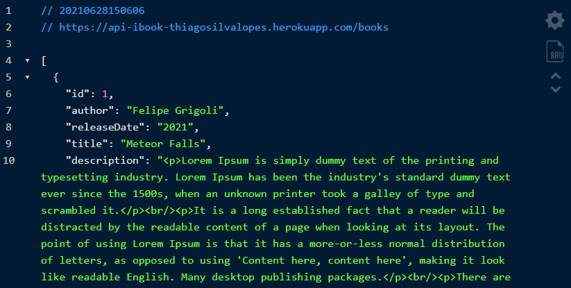

<!--
<div align="center">

</div>-->

# API com JsonServer para o projeto -> iBook

<p>Essa API Rest foi feita por: <strong>Thiago Silva Lopes</strong>, em 06/2021.</br>
Sendo utilizada no projeto -> <a href="https://github.com/Thiagoow/NuxtJs-IbookProject-ScalingVue">
iBook - Plataforma de leitura online para livros digitais</a>

## Demo: https://api-ibook-thiagosilvalopes.herokuapp.com/books

##### Para instalar o projeto localmente, com a pasta "node_modules":

```
npm install
```

##### Para compilar/executar o projeto localmente:

```
npm run dev
```

<small>© Thiago Silva Lopes </small>
